# 旅平險投保資料 EDA 分享版

> 版本用途：分享給組員快速掌握 EDA 結果。  
> 資料保護：本檔只包含彙總統計與圖表，不包含原始資料、客戶 ID、保單明細或可逐筆還原的資料。

## 分享建議

- 建議分享整個資料夾中的 `旅平險_EDA_分享版.md` 與 `charts/`，圖片路徑才會正常顯示。
- 不建議分享原始 CSV、可重跑原始資料的 notebook，或任何含有客戶識別碼的輸出。
- 若要再更正式，可以把這份 Markdown 轉成 PDF，讓組員只能閱讀彙總結果。

## 一句話摘要

資料顯示旅平險投保高度集中在海外與短天數旅遊，且多數人在出發前 0-3 天才投保；約四分之一客戶在資料期間有回購紀錄，回購間隔中位數約 4 個月。這支持後續用「回購行為、旅遊型態、保費價值、購買習慣」做客群分群，再為不同客群設計提醒時機與文案。

## 資料總覽

主檔足以支撐客戶層級分析；回購客戶占比約四分之一，是後續回購速度分析的核心樣本。

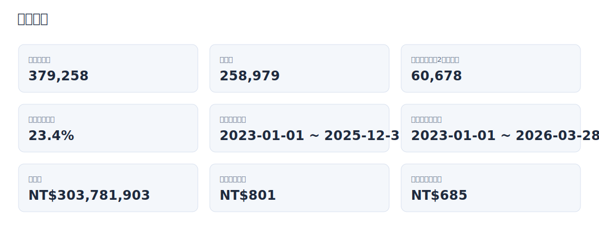

| 指標 | 結果 |
| --- | --- |
| 投保紀錄數 | 379,258 |
| 客戶數 | 258,979 |
| 回購客戶數（2次以上） | 60,678 |
| 回購客戶占比 | 23.4% |
| 投保日期範圍 | 2023-01-01 ~ 2025-12-31 |
| 旅程生效日範圍 | 2023-01-01 ~ 2026-03-28 |
| 總保費 | NT$303,781,903 |
| 平均單筆保費 | NT$801 |
| 中位數單筆保費 | NT$685 |

## 資料品質檢查

日期邏輯與投保天數整體一致；最大提醒是 `NO` 因遮罩而大量重複，不應作為唯一保單 ID。

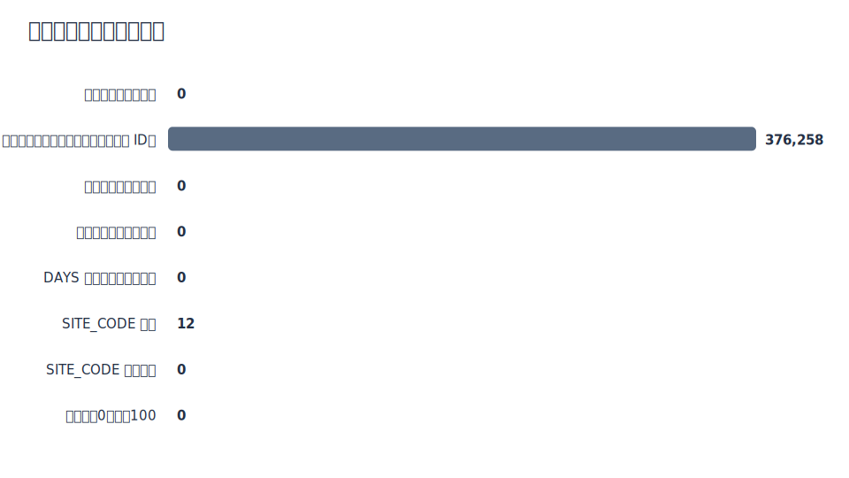

| 檢查項目 | 異常筆數 |
| --- | --- |
| 原始欄位完整列重複 | 0 |
| NO 重複筆數（遮罩後不適合當唯一保單 ID） | 376,258 |
| 投保日期晚於生效日 | 0 |
| 旅程結束日早於生效日 | 0 |
| DAYS 與生效起迄日不一致 | 0 |
| SITE_CODE 缺漏 | 12 |
| SITE_CODE 無法拆解 | 0 |
| 年齡小於0或大於100 | 0 |

## 主要數值欄位分布

保費、旅遊天數、提前投保天數與年齡，是後續分群最直覺的數值基礎。

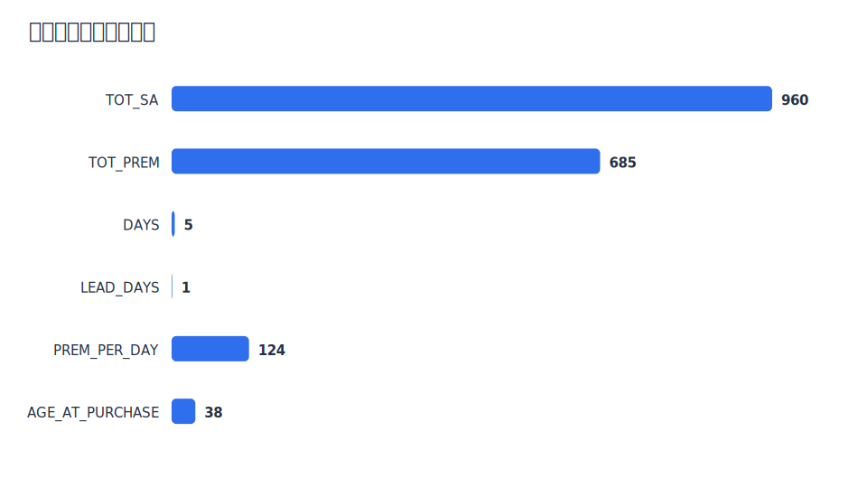

| 欄位 | 筆數 | 平均 | 標準差 | 最小值 | P25 | 中位數 | P75 | P95 | 最大值 |
| --- | --- | --- | --- | --- | --- | --- | --- | --- | --- |
| TOT_SA | 379,258.0 | 932.6 | 489.5 | 21.0 | 600.0 | 960.0 | 1,296.0 | 1,650.0 | 7,201.0 |
| TOT_PREM | 379,258.0 | 801.0 | 609.9 | 6.0 | 374.0 | 685.0 | 1,111.0 | 1,759.0 | 9,888.0 |
| DAYS | 379,258.0 | 7.4 | 12.6 | 1.0 | 4.0 | 5.0 | 7.0 | 16.0 | 180.0 |
| LEAD_DAYS | 379,258.0 | 3.8 | 7.4 | 0.0 | 0.0 | 1.0 | 4.0 | 16.0 | 92.0 |
| PREM_PER_DAY | 379,258.0 | 140.0 | 89.5 | 1.1 | 75.9 | 123.7 | 191.0 | 284.7 | 1,342.0 |
| AGE_AT_PURCHASE | 379,258.0 | 40.7 | 13.5 | 18.0 | 29.9 | 37.9 | 50.3 | 65.8 | 91.0 |

## 提前投保區間

大多數客戶在出發前 0-3 天才完成投保，提醒時機應該貼近出發日。

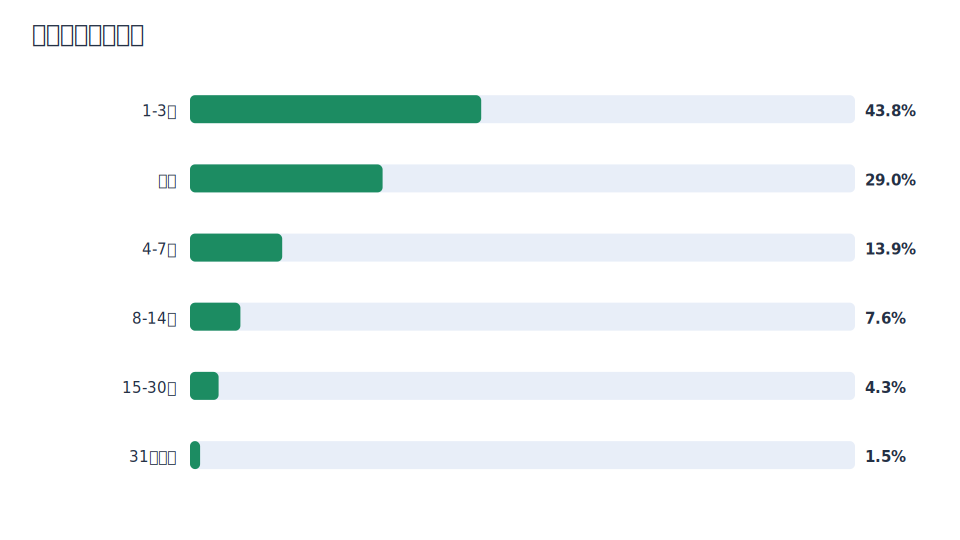

| 提前投保區間 | 投保筆數 | 占比 |
| --- | --- | --- |
| 1-3天 | 166,072 | 43.8% |
| 當天 | 109,826 | 29.0% |
| 4-7天 | 52,570 | 13.9% |
| 8-14天 | 28,716 | 7.6% |
| 15-30天 | 16,315 | 4.3% |
| 31天以上 | 5,759 | 1.5% |

## 旅遊天數區間

短天數旅遊占比高，這會影響保障訴求與文案長度，低摩擦投保會很重要。

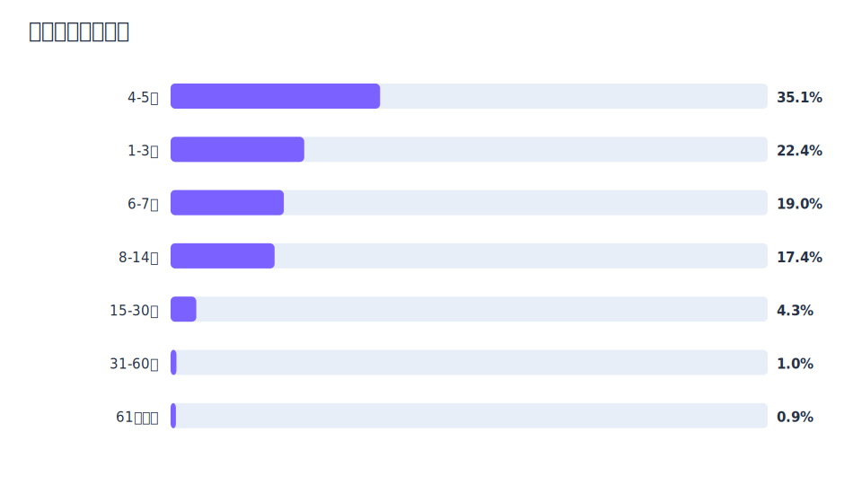

| 旅遊天數區間 | 投保筆數 | 占比 |
| --- | --- | --- |
| 4-5天 | 133,033 | 35.1% |
| 1-3天 | 84,871 | 22.4% |
| 6-7天 | 71,903 | 19.0% |
| 8-14天 | 66,021 | 17.4% |
| 15-30天 | 16,336 | 4.3% |
| 31-60天 | 3,717 | 1.0% |
| 61天以上 | 3,377 | 0.9% |

## 年齡區間

25-44 歲是主要投保族群，後續文案可優先考慮上班族、自由行與家庭出遊情境。

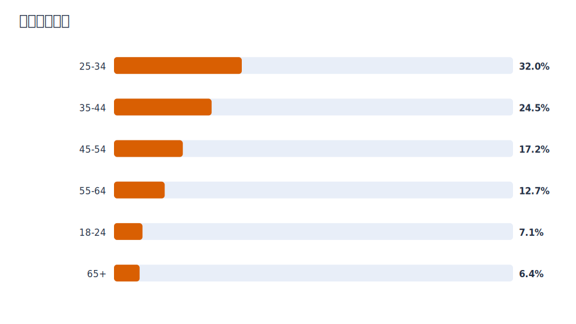

| 年齡區間 | 投保筆數 | 占比 |
| --- | --- | --- |
| 25-34 | 121,483 | 32.0% |
| 35-44 | 92,767 | 24.5% |
| 45-54 | 65,411 | 17.2% |
| 55-64 | 48,186 | 12.7% |
| 18-24 | 27,070 | 7.1% |
| 65+ | 24,341 | 6.4% |

## 旅遊型態

海外旅遊是主要投保情境；國內短天數族群仍可獨立觀察，因為提醒時機與保費價值可能不同。

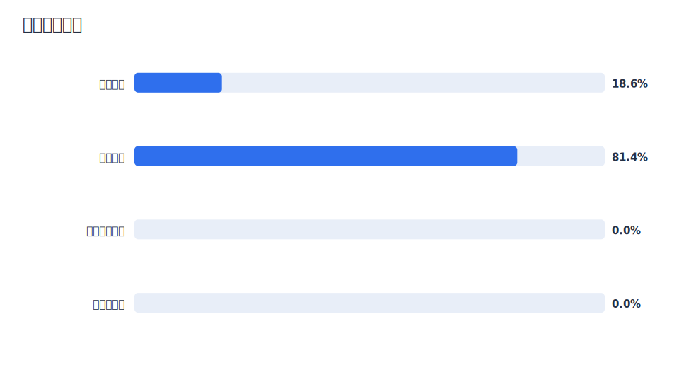

| 旅遊型態 | 投保筆數 | 占比 |
| --- | --- | --- |
| 單純國內 | 70,544 | 18.6% |
| 單純海外 | 308,702 | 81.4% |
| 國內海外混合 | 0 | 0.0% |
| 目的地缺漏 | 12 | 0.0% |

## 單筆目的地數

約九成以上是單一目的地，但多目的地旅遊仍能作為高複雜度旅遊型態的分群特徵。

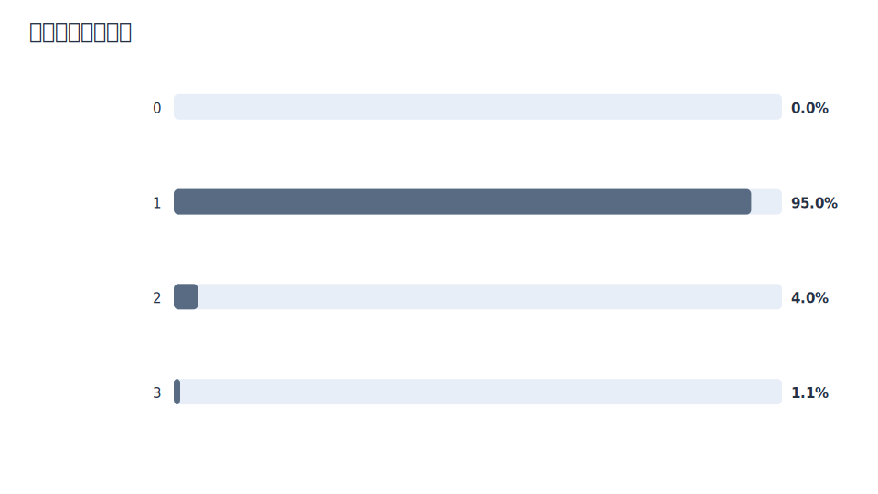

| 單筆目的地數 | 投保筆數 | 占比 |
| --- | --- | --- |
| 0 | 12 | 0.0% |
| 1 | 360,121 | 95.0% |
| 2 | 15,124 | 4.0% |
| 3 | 4,001 | 1.1% |

## 熱門目的地

日本、國內、南韓、東南亞與中國大陸是主要旅遊場景，適合後續設計目的地情境文案。

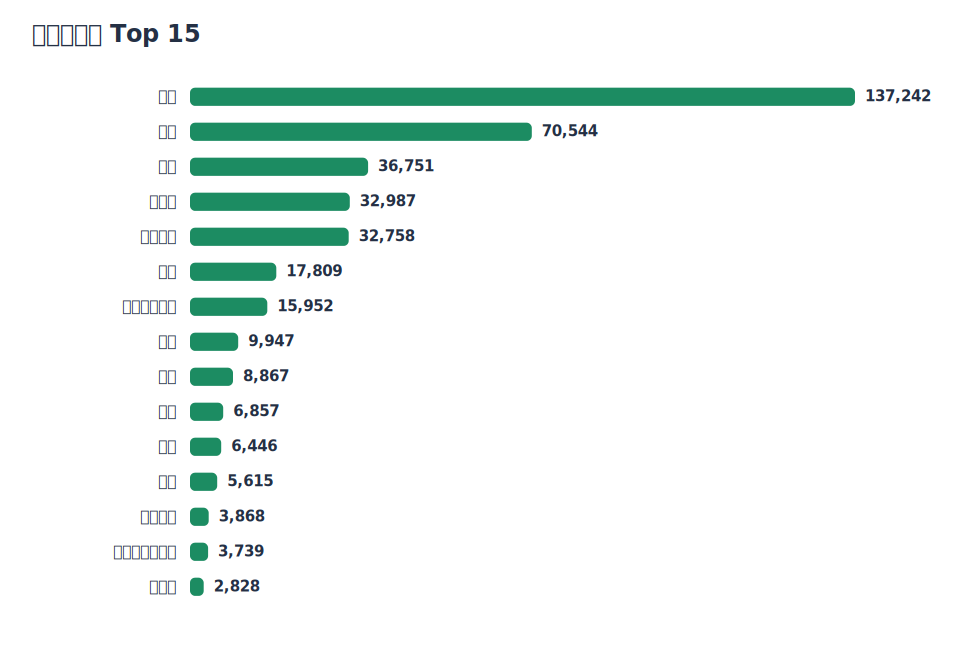

| 旅遊地點 | 出現次數 | 占全部投保紀錄比例 |
| --- | --- | --- |
| 日本 | 137,242 | 36.2% |
| 國內 | 70,544 | 18.6% |
| 南韓 | 36,751 | 9.7% |
| 東南亞 | 32,987 | 8.7% |
| 中國大陸 | 32,758 | 8.6% |
| 香港 | 17,809 | 4.7% |
| 歐洲申根國家 | 15,952 | 4.2% |
| 美國 | 9,947 | 2.6% |
| 泰國 | 8,867 | 2.3% |
| 其他 | 6,857 | 1.8% |
| 澳門 | 6,446 | 1.7% |
| 越南 | 5,615 | 1.5% |
| 澳大利亞 | 3,868 | 1.0% |
| 歐洲非申根國家 | 3,739 | 1.0% |
| 新加坡 | 2,828 | 0.7% |

## 付款代碼 Top 10

付款代碼可描述購買習慣，但銀行名稱來自輔助對照，建議只作為補充，不作過度推論。

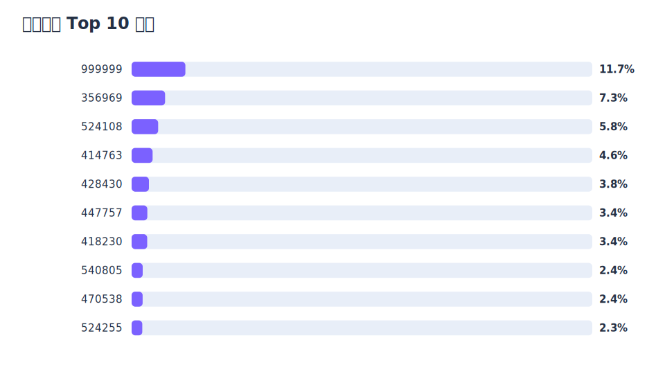

| CARD_BANK | 投保筆數 | 占比 | 輔助對照 |
| --- | --- | --- | --- |
| 999999 | 44,265 | 11.7% | LINE Pay 綁定信用卡支付 |
| 356969 | 27,541 | 7.3% | 台北富邦銀行，待確認 |
| 524108 | 21,820 | 5.8% | 台北富邦銀行，待確認 |
| 414763 | 17,279 | 4.6% | 台新銀行，待確認 |
| 428430 | 14,262 | 3.8% | 國泰世華銀行，待確認 |
| 447757 | 12,960 | 3.4% | 中國信託/CTBC，待確認 |
| 418230 | 12,817 | 3.4% | 中國信託/CTBC，待確認 |
| 540805 | 9,150 | 2.4% | 花旗台灣或星展台灣，待確認 |
| 470538 | 9,052 | 2.4% | 中華郵政，待確認 |
| 524255 | 8,807 | 2.3% | 玉山銀行，待確認 |

## 客戶層級總覽

客戶層級統計是後續分群主體，因為我們真正關心的是同一位客戶的完整投保行為。

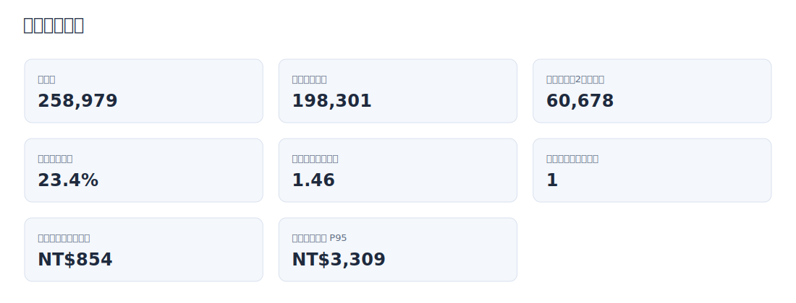

| 指標 | 結果 |
| --- | --- |
| 客戶數 | 258,979 |
| 一次購買客戶 | 198,301 |
| 回購客戶（2次以上） | 60,678 |
| 回購客戶占比 | 23.4% |
| 每人平均購買次數 | 1.46 |
| 每人購買次數中位數 | 1 |
| 每人累積保費中位數 | NT$854 |
| 每人累積保費 P95 | NT$3,309 |

## 客戶購買次數分布

多數客戶仍只購買一次，因此分群時要兼顧一次購買客與可觀察到回購的客戶。

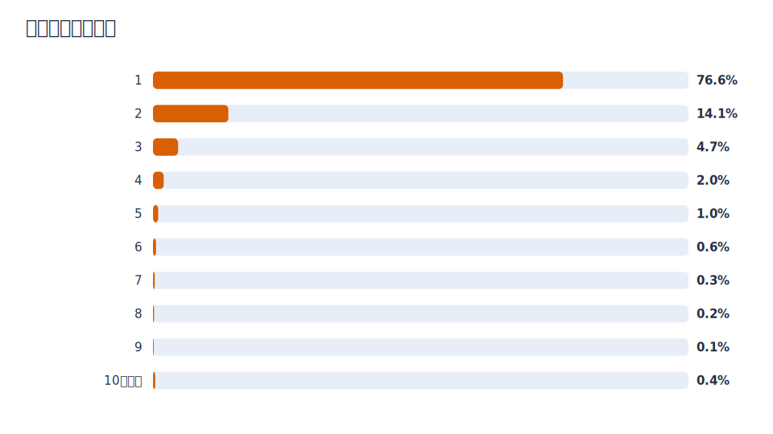

| 購買次數 | 客戶數 | 占全部客戶比例 |
| --- | --- | --- |
| 1 | 198,301 | 76.6% |
| 2 | 36,462 | 14.1% |
| 3 | 12,157 | 4.7% |
| 4 | 5,195 | 2.0% |
| 5 | 2,519 | 1.0% |
| 6 | 1,474 | 0.6% |
| 7 | 848 | 0.3% |
| 8 | 563 | 0.2% |
| 9 | 385 | 0.1% |
| 10次以上 | 1,075 | 0.4% |

## 回購間隔摘要

回購間隔中位數約 4 個月，後續可比較各客群是否存在明顯不同的回購週期。

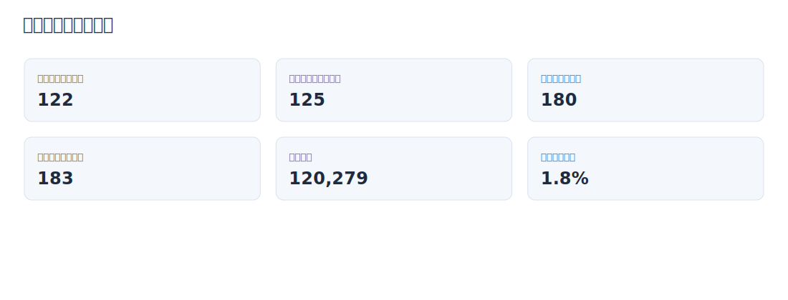

| 指標 | 含同日多筆投保 | 排除同日多筆投保 |
| --- | --- | --- |
| 回購次數 | 120,279 | 118,115 |
| 平均 | 180.1 | 183.4 |
| P25 | 47.0 | 50.0 |
| 中位數 | 122.0 | 125.0 |
| P75 | 257.0 | 261.0 |
| P90 | 419.0 | 423.0 |
| P95 | 557.0 | 560.0 |
| 最大值 | 1,087.0 | 1,087.0 |

## 回購間隔分布

可先用 30、90、180、365 天作為回購速度分層，再比較不同客群的差異。

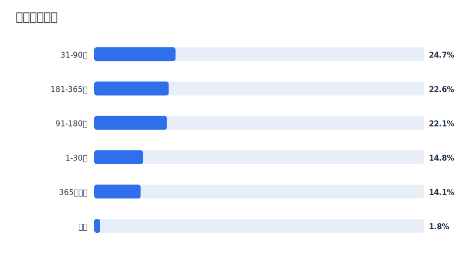

| 回購間隔 | 回購次數 | 占比 |
| --- | --- | --- |
| 31-90天 | 29,669 | 24.7% |
| 181-365天 | 27,171 | 22.6% |
| 91-180天 | 26,556 | 22.1% |
| 1-30天 | 17,795 | 14.8% |
| 365天以上 | 16,924 | 14.1% |
| 同日 | 2,164 | 1.8% |

## 年度趨勢

2023 到 2025 年投保筆數與保費皆呈上升，後續分析需注意不同年度的旅遊市場環境可能不同。

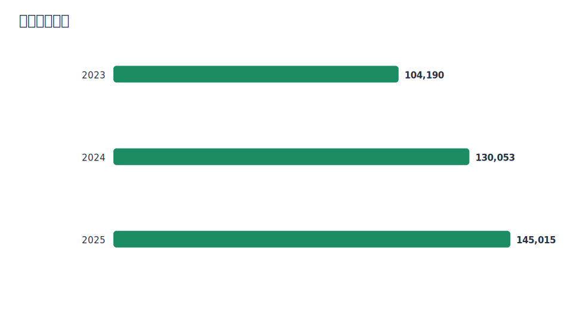

| PURCHASE_YEAR | 投保筆數 | 客戶數 | 總保費 | 平均保費 |
| --- | --- | --- | --- | --- |
| 2023 | 104,190 | 86,659 | NT$70,234,801 | NT$674 |
| 2024 | 130,053 | 104,338 | NT$100,613,747 | NT$774 |
| 2025 | 145,015 | 114,824 | NT$132,933,355 | NT$917 |

## 月度趨勢

月度波動可用來判斷旅遊旺季與提醒節奏；分享版僅保留月度彙總，不含每日明細。

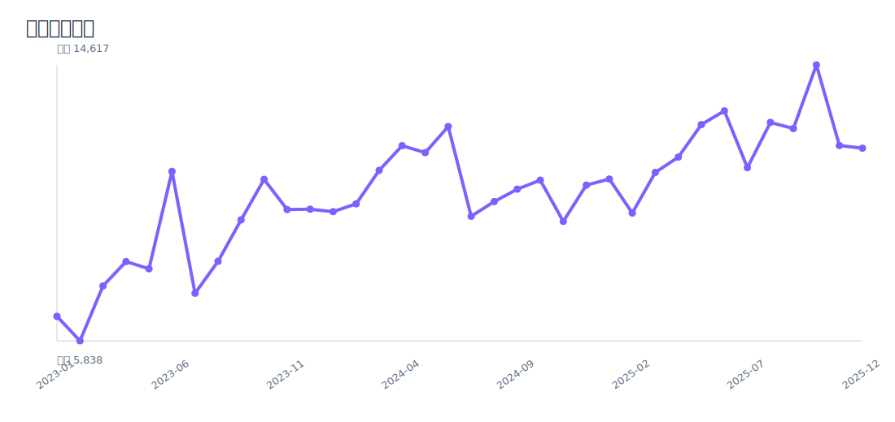

| PURCHASE_MONTH | 投保筆數 | 客戶數 | 總保費 | 平均提前投保天數 |
| --- | --- | --- | --- | --- |
| 2023-01 | 6,619 | 6,493 | NT$3,654,629 | 4.1 |
| 2023-02 | 5,838 | 5,722 | NT$3,014,825 | 3.9 |
| 2023-03 | 7,585 | 7,409 | NT$4,069,213 | 4.2 |
| 2023-04 | 8,361 | 8,169 | NT$4,233,119 | 3.6 |
| 2023-05 | 8,130 | 7,970 | NT$5,506,544 | 4.4 |
| 2023-06 | 11,230 | 10,996 | NT$8,436,667 | 3.7 |
| 2023-07 | 7,350 | 7,144 | NT$5,584,592 | 3.7 |
| 2023-08 | 8,369 | 8,172 | NT$6,087,598 | 4.1 |
| 2023-09 | 9,687 | 9,445 | NT$7,308,947 | 3.7 |
| 2023-10 | 10,977 | 10,735 | NT$8,015,470 | 3.5 |
| 2023-11 | 10,017 | 9,737 | NT$6,962,721 | 3.7 |
| 2023-12 | 10,027 | 9,780 | NT$7,360,476 | 3.5 |
| 2024-01 | 9,948 | 9,735 | NT$7,722,954 | 4.3 |
| 2024-02 | 10,196 | 10,012 | NT$7,803,314 | 3.7 |
| 2024-03 | 11,262 | 10,996 | NT$8,621,129 | 4.1 |
| 2024-04 | 12,048 | 11,745 | NT$8,871,229 | 3.5 |
| 2024-05 | 11,827 | 11,545 | NT$8,986,807 | 4.2 |
| 2024-06 | 12,657 | 12,337 | NT$9,732,549 | 3.5 |
| 2024-07 | 9,801 | 9,518 | NT$7,713,694 | 3.9 |
| 2024-08 | 10,269 | 9,989 | NT$7,929,739 | 3.8 |
| 2024-09 | 10,663 | 10,405 | NT$8,136,594 | 3.9 |
| 2024-10 | 10,950 | 10,639 | NT$8,256,231 | 4.1 |
| 2024-11 | 9,640 | 9,398 | NT$7,517,881 | 3.6 |
| 2024-12 | 10,792 | 10,514 | NT$9,321,626 | 3.4 |
| 2025-01 | 10,987 | 10,779 | NT$10,217,389 | 3.7 |
| 2025-02 | 9,904 | 9,638 | NT$9,042,924 | 4.1 |
| 2025-03 | 11,195 | 10,912 | NT$10,253,098 | 4.0 |
| 2025-04 | 11,684 | 11,406 | NT$10,122,864 | 3.4 |
| 2025-05 | 12,720 | 12,367 | NT$10,918,356 | 3.6 |
| 2025-06 | 13,156 | 12,828 | NT$12,061,822 | 3.6 |
| 2025-07 | 11,349 | 11,007 | NT$10,056,106 | 3.6 |
| 2025-08 | 12,790 | 12,377 | NT$11,434,319 | 3.8 |
| 2025-09 | 12,593 | 12,181 | NT$11,896,692 | 3.9 |
| 2025-10 | 14,617 | 14,056 | NT$13,848,936 | 3.5 |
| 2025-11 | 12,053 | 11,595 | NT$11,382,811 | 3.7 |
| 2025-12 | 11,967 | 11,604 | NT$11,698,038 | 3.4 |

## 投保星期

投保星期可作為行銷排程參考，但仍應與出發前幾天一起看。

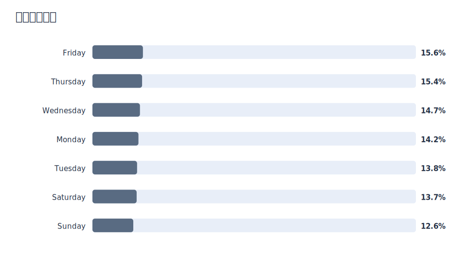

| 投保星期 | 投保筆數 | 占比 |
| --- | --- | --- |
| Friday | 59,220 | 15.6% |
| Thursday | 58,234 | 15.4% |
| Wednesday | 55,709 | 14.7% |
| Monday | 53,938 | 14.2% |
| Tuesday | 52,381 | 13.8% |
| Saturday | 51,859 | 13.7% |
| Sunday | 47,917 | 12.6% |

## 後續分析方向

這份 EDA 支援下一步建立客戶層級特徵，接著再做分群、回購速度比較與差異化文案設計。

| 分析面向 | 後續建議 |
| --- | --- |
| 回購行為 | 以購買次數、回購間隔、活躍期間區分高頻/低頻/快速回購客 |
| 旅遊型態 | 以國內海外、目的地數、熱門目的地區分旅遊情境 |
| 保費價值 | 以累積保費、平均保費、每旅遊日保費區分高價值與輕量客 |
| 購買習慣 | 以提前投保天數、投保月份、付款代碼作為提醒與渠道輔助 |
| 行銷策略 | 先依客群設計提醒時機，再依目的地與保費價值調整文案 |

