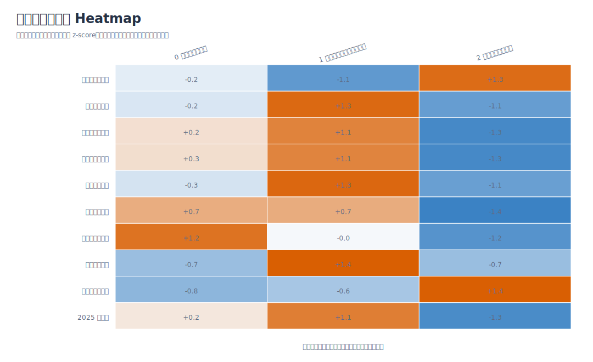
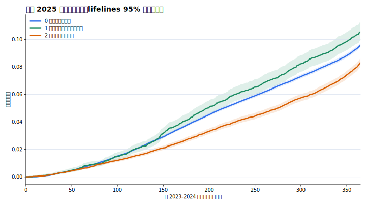

# 測試紀錄與結果

> 本文件紀錄 `簡報大綱.md` 的實作進度、測試比較與目前定稿結果。  
> 工作資料夾：`分群回購分析實作/`  
> 原始資料只讀取，不在原始資料夾中新增分析輸出。

## 0. 環境紀錄

- 本次環境已可使用 `scikit-learn`、`matplotlib`、`seaborn`、`lifelines`、`nbformat`、`nbclient`、`ipykernel`。
- 分群與分群指標已改用 `scikit-learn` 重跑；手寫 `numpy` 版保留為 fallback 與一致性對照。
- Kaplan-Meier 已補 `lifelines` 正式估計、95% 信賴區間與 pairwise log-rank test。
- 產圖時將 matplotlib cache 指到工作資料夾，避免寫入使用者家目錄失敗。

## 1. 是否照簡報大綱逐步完成

| 項目 | 狀態 | 說明 |
| --- | --- | --- |
| 建立獨立工作資料夾 | 完成 | 所有實作檔案集中於 `分群回購分析實作/` |
| 資料切分：2023-2024 建模、2025 驗證 | 完成 | 分群特徵只由 2023-2024 建立 |
| 建立 RFM 核心特徵 | 完成 | R=截至 2024-12-31 recency，F=投保次數，M=累積保費 |
| 測試 A-E 特徵組合 | 完成 | 每組 K=2 到 K=6；目前使用 scikit-learn 重跑 |
| 分群品質比較 | 完成 | 輸出 silhouette、Davies-Bouldin、CH、群體占比，並保留手寫版對照 |
| PCA 三維視覺化 | 完成 | 輸出靜態三維投影 SVG 與 PCA sample CSV |
| 2025 回購驗證 | 完成 | 計算各群 2025 回購率與回購天數 |
| Kaplan-Meier 回購曲線 | 完成 | 補上 lifelines 95% 信賴區間與 log-rank test |
| 客群輪廓 heatmap | 完成 | 輸出標準化 heatmap，方便簡報比較高低特徵 |
| K=4 商業解釋比較 | 完成 | 補做 B_RFM_travel / K=4 備選方案比較 |
| 行銷策略與文案 | 完成初版 | 依群體輪廓自動產生提醒時機與文案方向 |

## 2. 資料切分

| period | policies | customers | premium |
| --- | --- | --- | --- |
| 2023-2024 建模 | 234,243 | 172,609 | NT$170,848,548 |
| 2025 驗證 | 145,015 | 114,824 | NT$132,933,355 |

## 3. 特徵組合與 K 值比較

最終選擇：

- 特徵組合：`B_RFM_travel`
- K 值：`3`
- Silhouette sample：`0.438`
- Davies-Bouldin：`0.942`
- Calinski-Harabasz：`60307.9`
- 最小群體占比：`4.6%`

選擇理由：`A_RFM_only / K=2` 的 silhouette 最高，但只用 RFM 分成兩群，客群輪廓較粗，較難支撐「旅遊型態」與「差異化文案」；`B_RFM_travel / K=3` 的 silhouette 接近，Davies-Bouldin 較佳，且能分出海外主力、短天數臨行、多目的地長天數高價值三種較能轉成行銷策略的客群，因此先採用這組作為目前定稿版本。

Top 8 組合：

| feature_set | k | feature_count | silhouette_sample | davies_bouldin | calinski_harabasz | min_cluster_share | max_cluster_share |
| --- | --- | --- | --- | --- | --- | --- | --- |
| A_RFM_only | 2 | 3 | 0.456 | 1.123 | 87,615.730 | 20.6% | 79.4% |
| B_RFM_travel | 3 | 6 | 0.438 | 0.942 | 60,307.915 | 4.6% | 77.1% |
| B_RFM_travel | 4 | 6 | 0.421 | 1.024 | 70,310.767 | 4.1% | 62.4% |
| C_RFM_purchase | 3 | 5 | 0.420 | 1.084 | 87,290.650 | 15.6% | 58.5% |
| A_RFM_only | 5 | 3 | 0.403 | 0.928 | 93,532.176 | 4.1% | 51.9% |
| A_RFM_only | 3 | 3 | 0.393 | 1.014 | 82,448.219 | 16.0% | 67.6% |
| C_RFM_purchase | 2 | 5 | 0.389 | 1.153 | 82,882.536 | 29.9% | 70.1% |
| A_RFM_only | 4 | 3 | 0.386 | 0.949 | 92,534.181 | 12.8% | 53.0% |

### 3.1 scikit-learn 與手寫版一致性檢查

下表保留幾個主要候選組合的重跑結果。`scikit-learn` 與手寫版的指標排序方向大致一致；小幅差異主要來自 K-means 初始化、收斂細節與 silhouette 抽樣。

| feature_set | k | implementation | silhouette_sample | davies_bouldin | calinski_harabasz | min_cluster_share | max_cluster_share |
| --- | --- | --- | --- | --- | --- | --- | --- |
| A_RFM_only | 2 | numpy_manual | 0.456 | 1.123 | 87,615.339 | 20.5% | 79.5% |
| A_RFM_only | 2 | scikit-learn | 0.456 | 1.123 | 87,615.730 | 20.6% | 79.4% |
| B_RFM_travel | 3 | numpy_manual | 0.438 | 0.942 | 60,307.909 | 4.6% | 77.1% |
| B_RFM_travel | 3 | scikit-learn | 0.438 | 0.942 | 60,307.915 | 4.6% | 77.1% |
| B_RFM_travel | 4 | numpy_manual | 0.421 | 1.024 | 70,310.333 | 4.2% | 62.5% |
| B_RFM_travel | 4 | scikit-learn | 0.421 | 1.024 | 70,310.767 | 4.1% | 62.4% |
| C_RFM_purchase | 3 | numpy_manual | 0.420 | 1.086 | 87,289.971 | 15.7% | 58.4% |
| C_RFM_purchase | 3 | scikit-learn | 0.420 | 1.084 | 87,290.650 | 15.6% | 58.5% |

## 4. PCA 視覺化

前三個主成分解釋變異：

| component | explained_variance_ratio |
| --- | --- |
| PC1 | 36.4% |
| PC2 | 22.2% |
| PC3 | 15.8% |

## 5. 最終客群輪廓

| cluster | cluster_name | customers | customer_share | recency_median | frequency_mean | total_premium_median | avg_premium_median | avg_days_mean | short_notice_share_mean | repurchase_rate_2025 | event_time_median |
| --- | --- | --- | --- | --- | --- | --- | --- | --- | --- | --- | --- |
| 0 | 海外日本主力客 | 133,164 | 77.1% | 287.0 | 1.4 | NT$887 | NT$745 | 8.0 | 69.8% | 16.7% | 337.0 |
| 1 | 多目的地長天數高價值客 | 7,995 | 4.6% | 262.0 | 1.4 | NT$1,230 | NT$1,018 | 18.4 | 70.5% | 17.6% | 320.0 |
| 2 | 臨行前快速投保客 | 31,450 | 18.2% | 324.0 | 1.3 | NT$243 | NT$212 | 2.9 | 78.7% | 15.3% | 355.0 |

## 6. 2025 回購驗證

| cluster | customers | repurchase_2025 | repurchase_rate_2025 | event_time_median | km_repurchase_30d | km_repurchase_60d | km_repurchase_90d | km_repurchase_180d | km_repurchase_365d |
| --- | --- | --- | --- | --- | --- | --- | --- | --- | --- |
| 0 | 133,164 | 22,240 | 16.7% | 337.0 | 0.2% | 0.7% | 1.3% | 3.9% | 9.6% |
| 1 | 7,995 | 1,409 | 17.6% | 320.0 | 0.2% | 0.6% | 1.2% | 4.3% | 10.5% |
| 2 | 31,450 | 4,805 | 15.3% | 355.0 | 0.2% | 0.6% | 1.1% | 2.8% | 8.3% |

### 6.1 與整體 2025 回購率比較

這張表才是判斷分群有沒有驗證效果時最直覺看的地方。`overall_repurchase_rate_2025` 是不分群時的整體基準；`rate_diff_vs_overall` 和 `lift_vs_overall` 則看每一群是否高於或低於這個基準。

| cluster | cluster_name | customers | repurchase_rate_2025 | overall_repurchase_rate_2025 | rate_diff_vs_overall | lift_vs_overall | event_time_median | validation_reading |
| --- | --- | --- | --- | --- | --- | --- | --- | --- |
| 0 | 海外日本主力客 | 133,164 | 16.7% | 16.5% | 0.2% | 1.01x | 337.0 | 高於整體平均，代表此群回購傾向較強 |
| 1 | 多目的地長天數高價值客 | 7,995 | 17.6% | 16.5% | 1.1% | 1.07x | 320.0 | 高於整體平均，代表此群回購傾向較強 |
| 2 | 臨行前快速投保客 | 31,450 | 15.3% | 16.5% | -1.2% | 0.93x | 355.0 | 低於整體平均，代表此群回購傾向較弱 |

`lifelines` 補強狀態：lifelines Kaplan-Meier、95% 信賴區間與 pairwise log-rank test 已完成。

| pair | test_statistic | p_value |
| --- | --- | --- |
| 0 海外日本主力客 vs 1 多目的地長天數高價值客 | 8.367 | 0.00382 |
| 0 海外日本主力客 vs 2 臨行前快速投保客 | 72.688 | 1.518e-17 |
| 1 多目的地長天數高價值客 vs 2 臨行前快速投保客 | 50.037 | 1.509e-12 |

## 7. B_RFM_travel / K=4 商業解釋比較

| cluster | cluster_name | customers | customer_share | recency_median | total_premium_median | avg_days_mean | intl_share_mean | multi_dest_share_mean | repurchase_rate_2025 | business_summary |
| --- | --- | --- | --- | --- | --- | --- | --- | --- | --- | --- |
| 0 | 海外日本主力客 | 107,788 | 62.4% | 337.0 | NT$739 | 8.0 | 99.7% | 0.0% | 11.8% | 海外旅遊占比高，且日本目的地占比突出，是目前資料中的主力客群 |
| 1 | 臨行前快速投保客 | 30,088 | 17.4% | 335.0 | NT$228 | 2.9 | 1.1% | 0.0% | 13.8% | 短天數、低保費、臨行前投保比例高，較像國內或近程快速需求 |
| 2 | 近期高價值回購客 | 27,583 | 16.0% | 112.0 | NT$1,871 | 8.0 | 90.2% | 3.0% | 38.0% | 最近一次投保較近、保費中位數高，且 2025 回購率明顯較高 |
| 3 | 多目的地長天數高價值客 | 7,150 | 4.1% | 290.5 | NT$1,150 | 19.3 | 99.6% | 92.5% | 14.9% | 長天數或多目的地行程明顯，客單價與保障完整度較重要 |

K=3 與 K=4 的簡報取捨：

| 方案 | 客群數 | 最小群占比 | 商業解釋 | 簡報建議 |
| --- | --- | --- | --- | --- |
| K=3 | 3 | 4.6% 左右 | 三群輪廓清楚：海外日本主力、臨行前快速投保、多目的地長天數高價值 | 作為定稿主方案，容易命名與轉成策略 |
| K=4 | 4 | 4.1% | 可再拆細大型海外主力客，但多一群後命名與策略呈現更複雜 | 可放在備選比較，說明曾測試拆細但仍採 K=3 |

## 8. 行銷策略與文案初版

| cluster | cluster_name | marketing_priority | first_reminder | second_reminder | copy_direction | sample_copy |
| --- | --- | --- | --- | --- | --- | --- |
| 0 | 海外日本主力客 | 中 | 賞櫻/暑假/楓葉季前 | 上次投保後 90-150 天 | 以日本旅遊情境設計文案 | 準備再去日本了嗎？機票住宿安排好，也別忘了把旅平險一起準備好。 |
| 1 | 多目的地長天數高價值客 | 高 | 上次投保後 120-180 天 | 旅遊旺季或長假前 | 強調海外醫療、完整保障、多國或長天數行程安心 | 多國或長天數行程更需要完整保障，出發前記得確認旅平險是否已安排。 |
| 2 | 臨行前快速投保客 | 中 | 連假/旺季前 7 天 | 出發前 1-3 天 | 強調快速投保、少步驟、出發前提醒 | 出發前別忘了旅平險，幾分鐘完成投保，行程更安心。 |

> 這裡只保留自動產生的初版策略方向；「改成更像品牌行銷語氣」刻意不處理，留給負責文案的組員發想。

## 9. 目前觀察到的重點

1. 這次未使用 2025 資訊建立分群，符合避免資料洩漏原則。
2. RFM 與精簡加值特徵比舊版大量特徵更容易解釋，也更適合轉成簡報。
3. 各群 2025 回購率與回購曲線已可比較；正式簡報時可用這些結果決定提醒優先級。
4. 與整體 2025 回購率相比，高價值長天數客略高、臨行前快速投保客略低，代表分群有驗證出方向性差異，但 lift 幅度不大。
5. K=4 可以拆細部分海外主力客，但策略溝通成本較高，因此目前仍建議以 K=3 作為簡報主方案。
6. 行銷策略目前只保留依客群輪廓與 2025 驗證自動產生的初版，不做品牌語氣潤飾。

## 10. 9.5 後續優先改善事項執行結果

| 原優先事項 | 本次狀態 |
| --- | --- |
| 用 `scikit-learn` 重跑 K-means 與分群指標 | 已完成，並輸出 `outputs/implementation_comparison.csv` |
| 補做 `B_RFM_travel / K=4` 商業解釋比較 | 已完成，並輸出 K=4 輪廓與 K=3/K=4 比較表 |
| 用 `lifelines` 補正式 Kaplan-Meier 圖、信賴區間與 log-rank test | 已完成，輸出 lifelines 曲線、信賴區間與 pairwise log-rank test |
| 補一張客群輪廓 heatmap | 已完成，輸出 `charts/05_cluster_profile_heatmap.svg` |
| 由負責文案的組員改寫品牌行銷語氣 | 本次刻意保留不做，留給組員發想 |

## 11. 產出檔案

- Notebook：`客群分群_回購驗證_分析.ipynb`
- 特徵組合比較：`outputs/feature_set_comparison.csv`
- scikit-learn / 手寫版一致性對照：`outputs/implementation_comparison.csv`
- 最終客群輪廓：`outputs/final_cluster_profile.csv`
- 2025 驗證表：`outputs/validation_by_cluster.csv`
- 2025 回購率相對整體基準比較：`outputs/validation_lift_vs_overall.csv`
- KM 曲線資料：`outputs/km_curve_by_cluster.csv`
- lifelines KM 曲線資料：`outputs/km_curve_by_cluster_lifelines.csv`
- log-rank test：`outputs/km_logrank_test.csv`
- 客群輪廓 heatmap 資料：`outputs/cluster_profile_heatmap.csv`
- K=4 備選輪廓：`outputs/b_rfm_travel_k4_profile.csv`
- K=3/K=4 商業比較：`outputs/b_rfm_travel_k3_k4_business_comparison.csv`
- 策略建議：`outputs/strategy_recommendations.csv`
- 圖表：`charts/*.svg`
