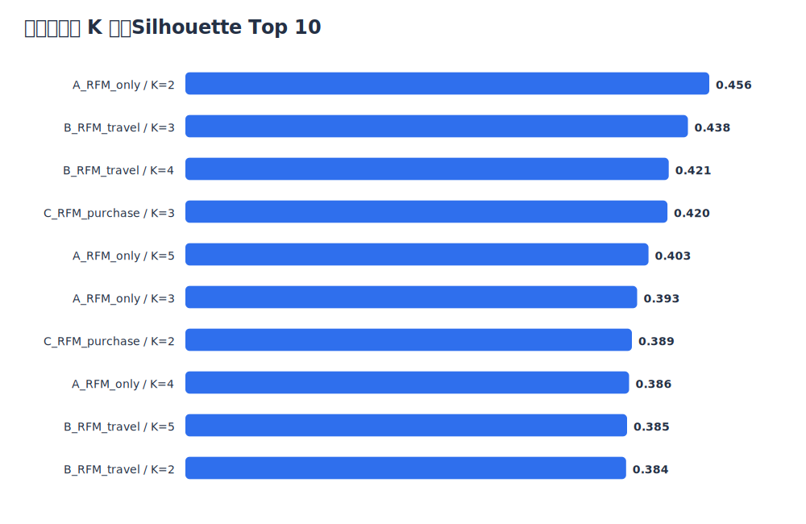
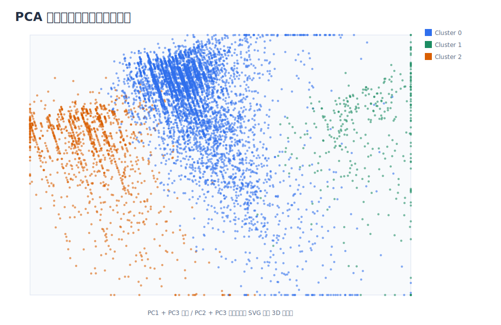
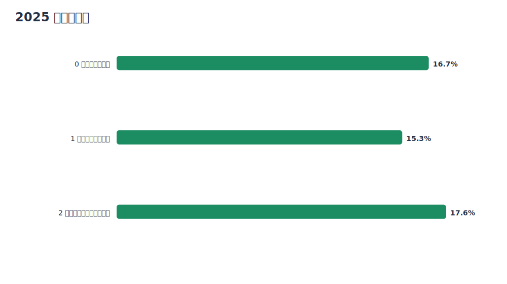
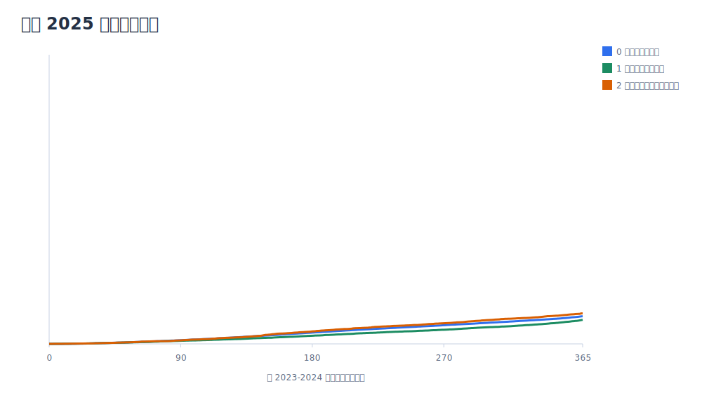

# 測試紀錄與結果

> 本文件紀錄 `簡報大綱.md` 的實作進度、測試比較與目前定稿結果。  
> 工作資料夾：`分群回購分析實作/`  
> 原始資料只讀取，不在原始資料夾中新增分析輸出。

## 0. 環境紀錄

- 原先計畫安裝 `scikit-learn`、`matplotlib`、`nbformat`、`nbclient`、`ipykernel`。
- 因目前環境無法解析 PyPI 主機，安裝失敗。
- 為避免工作流程中斷，改用既有可用套件 `pandas`、`numpy` 自行實作 K-means、PCA、分群指標與 Kaplan-Meier。
- 未額外安裝 `lifelines`；生存分析用手寫 Kaplan-Meier 計算。

## 1. 是否照簡報大綱逐步完成

| 項目 | 狀態 | 說明 |
| --- | --- | --- |
| 建立獨立工作資料夾 | 完成 | 所有實作檔案集中於 `分群回購分析實作/` |
| 資料切分：2023-2024 建模、2025 驗證 | 完成 | 分群特徵只由 2023-2024 建立 |
| 建立 RFM 核心特徵 | 完成 | R=截至 2024-12-31 recency，F=投保次數，M=累積保費 |
| 測試 A-E 特徵組合 | 完成 | 每組 K=2 到 K=6 |
| 分群品質比較 | 完成 | 輸出 silhouette、Davies-Bouldin、CH、群體占比 |
| PCA 三維視覺化 | 完成 | 輸出靜態三維投影 SVG 與 PCA sample CSV |
| 2025 回購驗證 | 完成 | 計算各群 2025 回購率與回購天數 |
| Kaplan-Meier 回購曲線 | 完成 | 以 numpy/pandas 自行計算，不依賴 lifelines |
| 行銷策略與文案 | 完成初版 | 依群體輪廓自動產生提醒時機與文案方向 |

## 2. 資料切分

| period | policies | customers | premium |
| --- | --- | --- | --- |
| 2023-2024 建模 | 234,243 | 172,609 | NT$170,848,548 |
| 2025 驗證 | 145,015 | 114,824 | NT$132,933,355 |

## 3. 特徵組合與 K 值比較

最終選擇：

- 特徵組合：`B_RFM_travel`
- K 值：`3`
- Silhouette sample：`0.438`
- Davies-Bouldin：`0.942`
- Calinski-Harabasz：`60307.9`
- 最小群體占比：`4.6%`

選擇理由：`A_RFM_only / K=2` 的 silhouette 最高，但只用 RFM 分成兩群，客群輪廓較粗，較難支撐「旅遊型態」與「差異化文案」；`B_RFM_travel / K=3` 的 silhouette 接近，Davies-Bouldin 較佳，且能分出海外主力、短天數臨行、多目的地長天數高價值三種較能轉成行銷策略的客群，因此先採用這組作為目前定稿版本。

### 3.1 Top 8 組合使用的特徵

| 排名 | feature_set / K | feature_count | 使用特徵 |
| --- | --- | ---: | --- |
| 1 | `A_RFM_only / K=2` | 3 | `recency_days`, `frequency`, `total_premium` |
| 2 | `B_RFM_travel / K=3` | 6 | `recency_days`, `frequency`, `total_premium`, `avg_days`, `intl_share`, `multi_dest_share` |
| 3 | `B_RFM_travel / K=4` | 6 | `recency_days`, `frequency`, `total_premium`, `avg_days`, `intl_share`, `multi_dest_share` |
| 4 | `C_RFM_purchase / K=3` | 5 | `recency_days`, `frequency`, `total_premium`, `avg_lead_days`, `short_notice_share` |
| 5 | `A_RFM_only / K=5` | 3 | `recency_days`, `frequency`, `total_premium` |
| 6 | `A_RFM_only / K=3` | 3 | `recency_days`, `frequency`, `total_premium` |
| 7 | `C_RFM_purchase / K=2` | 5 | `recency_days`, `frequency`, `total_premium`, `avg_lead_days`, `short_notice_share` |
| 8 | `A_RFM_only / K=4` | 3 | `recency_days`, `frequency`, `total_premium` |

特徵中文解釋：

| 特徵 | 中文意義 | 放入原因 |
| --- | --- | --- |
| `recency_days` | 截至 2024-12-31，距離客戶最近一次投保過了幾天 | RFM 中的 R，衡量近期活躍程度 |
| `frequency` | 2023-2024 投保次數 | RFM 中的 F，衡量投保頻率 |
| `total_premium` | 2023-2024 累積保費 | RFM 中的 M，衡量累積保費價值 |
| `avg_days` | 平均旅遊/投保天數 | 區分短天數旅遊與長天數旅遊 |
| `intl_share` | 海外旅遊投保占比 | 區分國內旅遊與海外旅遊客 |
| `multi_dest_share` | 多目的地投保占比 | 區分單一目的地與複雜行程 |
| `avg_lead_days` | 平均提前幾天投保 | 區分提前規劃與臨時投保 |
| `short_notice_share` | 出發前 3 天內投保占比 | 捕捉臨行前購買習慣 |

### 3.2 評估指標的意義

| 指標 | 越高/越低越好 | 意義 | 為何要比較 |
| --- | --- | --- | --- |
| `Silhouette sample` | 越高越好 | 衡量同群是否夠近、不同群是否夠遠，範圍約 -1 到 1 | 判斷分群是否清楚 |
| `Davies-Bouldin` | 越低越好 | 衡量群內分散與群間距離，越低代表群與群比較分開 | 補充 silhouette，避免只看單一指標 |
| `Calinski-Harabasz` | 越高越好 | 衡量群間變異相對於群內變異是否夠大 | 判斷分群整體分離程度 |
| `min_cluster_share` | 不宜太低 | 最小群占全部客戶比例 | 避免切出太小、沒有商業操作價值的群 |
| `max_cluster_share` | 不宜太高 | 最大群占全部客戶比例 | 避免大部分人都被塞進同一群，分群太粗 |

補充：`Silhouette sample` 是抽樣估計，因為全量客戶距離矩陣非常大，直接全算會消耗大量記憶體。它適合用來比較不同組合的方向，但不應把小數點後非常細的差異解讀得過度精確。

### 3.3 為何最後選擇 `B_RFM_travel / K=3`

雖然 `A_RFM_only / K=2` 的 silhouette 最高，達到 0.456，但它只使用 RFM 三個特徵，且只分成兩群。這樣的結果雖然統計分數好，但商業輪廓太粗，較難支撐本次題目中的「旅遊型態差異」與「差異化行銷文案」。

`B_RFM_travel / K=3` 的優點：

1. **分群分數仍接近最佳**：silhouette 為 0.438，和最高的 0.456 差距不大。
2. **Davies-Bouldin 更好**：`B_RFM_travel / K=3` 為 0.942，優於 `A_RFM_only / K=2` 的 1.123，代表群間分離與群內集中程度更平衡。
3. **特徵更貼近題目**：除了 RFM，也加入 `avg_days`、`intl_share`、`multi_dest_share`，能回應旅遊型態差異。
4. **能形成可行銷的三群**：海外日本主力客、臨行前快速投保客、多目的地長天數高價值客。
5. **比 K=4 更適合簡報**：`B_RFM_travel / K=4` 分數也不差，但群更碎；以期末報告與行銷策略初版來說，K=3 更好命名、好解釋、好轉成文案。

因此，本次不是單純選統計分數最高的組合，而是選擇「統計表現夠好 + 客群可解釋 + 能支撐行銷策略」的組合。

Top 8 組合：

| feature_set | k | feature_count | silhouette_sample | davies_bouldin | calinski_harabasz | min_cluster_share | max_cluster_share |
| --- | --- | --- | --- | --- | --- | --- | --- |
| A_RFM_only | 2 | 3 | 0.456 | 1.123 | 87,615.339 | 20.5% | 79.5% |
| B_RFM_travel | 3 | 6 | 0.438 | 0.942 | 60,307.909 | 4.6% | 77.1% |
| B_RFM_travel | 4 | 6 | 0.421 | 1.024 | 70,310.333 | 4.2% | 62.5% |
| C_RFM_purchase | 3 | 5 | 0.420 | 1.086 | 87,289.971 | 15.7% | 58.4% |
| A_RFM_only | 5 | 3 | 0.404 | 0.928 | 93,531.333 | 4.1% | 51.9% |
| A_RFM_only | 3 | 3 | 0.393 | 1.015 | 82,448.370 | 16.0% | 67.6% |
| C_RFM_purchase | 2 | 5 | 0.389 | 1.153 | 82,882.527 | 29.9% | 70.1% |
| A_RFM_only | 4 | 3 | 0.387 | 0.948 | 92,535.760 | 12.9% | 53.0% |



## 4. PCA 視覺化

前三個主成分解釋變異：

| component | explained_variance_ratio |
| --- | --- |
| PC1 | 36.4% |
| PC2 | 22.2% |
| PC3 | 15.8% |



## 5. 最終客群輪廓

| cluster | cluster_name | customers | customer_share | recency_median | frequency_mean | total_premium_median | avg_premium_median | avg_days_mean | short_notice_share_mean | repurchase_rate_2025 | event_time_median |
| --- | --- | --- | --- | --- | --- | --- | --- | --- | --- | --- | --- |
| 0 | 海外日本主力客 | 133,166 | 77.1% | 287.0 | 1.4 | NT$887 | NT$745 | 8.0 | 69.8% | 16.7% | 337.0 |
| 1 | 臨行前快速投保客 | 31,446 | 18.2% | 324.0 | 1.3 | NT$243 | NT$212 | 2.9 | 78.7% | 15.3% | 355.0 |
| 2 | 多目的地長天數高價值客 | 7,997 | 4.6% | 262.0 | 1.4 | NT$1,231 | NT$1,018 | 18.4 | 70.5% | 17.6% | 320.0 |

## 6. 2025 回購驗證

| cluster | customers | repurchase_2025 | repurchase_rate_2025 | event_time_median | km_repurchase_30d | km_repurchase_60d | km_repurchase_90d | km_repurchase_180d | km_repurchase_365d |
| --- | --- | --- | --- | --- | --- | --- | --- | --- | --- |
| 0 | 133,166 | 22,239 | 16.7% | 337.0 | 0.2% | 0.7% | 1.3% | 3.9% | 9.6% |
| 1 | 31,446 | 4,805 | 15.3% | 355.0 | 0.2% | 0.6% | 1.1% | 2.8% | 8.3% |
| 2 | 7,997 | 1,410 | 17.6% | 320.0 | 0.2% | 0.6% | 1.2% | 4.3% | 10.6% |





## 7. 行銷策略與文案初版

| cluster | cluster_name | marketing_priority | first_reminder | second_reminder | copy_direction | sample_copy |
| --- | --- | --- | --- | --- | --- | --- |
| 0 | 海外日本主力客 | 中 | 賞櫻/暑假/楓葉季前 | 上次投保後 90-150 天 | 以日本旅遊情境設計文案 | 準備再去日本了嗎？機票住宿安排好，也別忘了把旅平險一起準備好。 |
| 1 | 臨行前快速投保客 | 中 | 連假/旺季前 7 天 | 出發前 1-3 天 | 強調快速投保、少步驟、出發前提醒 | 出發前別忘了旅平險，幾分鐘完成投保，行程更安心。 |
| 2 | 多目的地長天數高價值客 | 高 | 上次投保後 120-180 天 | 旅遊旺季或長假前 | 強調海外醫療、完整保障、多國或長天數行程安心 | 多國或長天數行程更需要完整保障，出發前記得確認旅平險是否已安排。 |

## 8. 目前觀察到的重點

1. 這次未使用 2025 資訊建立分群，符合避免資料洩漏原則。
2. RFM 與精簡加值特徵比舊版大量特徵更容易解釋，也更適合轉成簡報。
3. 各群 2025 回購率與回購曲線已可比較；正式簡報時可用這些結果決定提醒優先級。
4. PCA 圖是靜態 SVG 的三維投影版，若之後環境允許安裝互動式套件，可再補互動 3D 圖。
5. 行銷策略目前是依客群輪廓與 2025 驗證自動產生的初版，後續可由負責文案的組員再潤飾。

## 9. 目前不足與風險紀錄

### 9.1 套件環境限制

原本已取得同意，預計安裝以下套件：

| 套件 | 原本用途 | 目前替代方式 | 影響 |
| --- | --- | --- | --- |
| `scikit-learn` | K-means、PCA、silhouette、Davies-Bouldin、Calinski-Harabasz | 使用 `numpy` 手寫簡化版 | 可完成分析，但穩定性、速度、與標準套件一致性不如正式套件 |
| `matplotlib` | 視覺化圖表 | 手寫 SVG | 可輸出靜態圖，但美觀度、標籤避讓、互動性有限 |
| `plotly` | 互動式 3D PCA 圖 | 手寫靜態 3D 投影 SVG | 目前不是可旋轉 3D 圖，只是靜態近似投影 |
| `lifelines` | Kaplan-Meier 生存曲線 | 使用 `pandas`/`numpy` 手寫 KM | 可算累積回購率，但缺少信賴區間、log-rank test 等完整生存分析工具 |
| `nbformat` / `nbclient` / `ipykernel` | 正式建立並執行 notebook | 以 JSON 產出 notebook 骨架 | notebook 可閱讀，但沒有完整執行輸出與互動圖 |

安裝失敗原因：目前環境無法解析 PyPI 主機，因此無法從網路下載套件。為避免工作中斷，第一版改用現有套件完成。

### 9.2 分群方法限制

| 限制 | 說明 | 對簡報的影響 |
| --- | --- | --- |
| K-means 為手寫簡化版 | 雖有多次初始化與收斂判斷，但不如 `scikit-learn` 經完整優化 | 正式交付前建議用 `scikit-learn` 重跑確認 |
| Silhouette 使用抽樣估計 | 為避免距離矩陣過大，只抽樣 3,000 位客戶計算 | 指標可比較方向，但不是全量精確值 |
| 最終選擇非 silhouette 最高組合 | `A_RFM_only / K=2` 分數最高，但商業解釋較粗 | 報告需說明選擇 `B_RFM_travel / K=3` 是兼顧統計與策略可用性 |
| 客群 0 人數占比偏高 | 海外日本主力客占 77.1%，代表資料主要行為仍集中 | 若希望更細，可再測試 K=4 或調整特徵權重 |
| 回購率差異不算非常大 | 三群 2025 回購率約 15.3%-17.6% | 簡報要避免誇大，應說「有方向性差異」而非「差異非常明顯」 |

### 9.3 視覺化不足

目前圖表已可放入初版簡報，但若要「完美呈現」，仍建議後續補強：

| 圖表 | 目前狀態 | 建議補強 |
| --- | --- | --- |
| 特徵組合比較圖 | 靜態 SVG bar chart | 用 `matplotlib` 或 `seaborn` 製作更精緻的比較圖，加入 K 值與指標標籤 |
| PCA 圖 | 靜態近似 3D 投影 | 用 `plotly` 製作可旋轉 3D scatter plot，並輸出 HTML 或截圖 |
| KM 回購曲線 | 靜態 SVG line chart | 用 `lifelines` + `matplotlib` 補信賴區間、風險人數表、log-rank test |
| 客群輪廓圖 | 目前只有表格 | 建議加入 radar chart 或 standardized profile heatmap |
| 行銷策略圖 | 目前只有表格 | 建議做成每群一張 strategy card，方便簡報呈現 |

### 9.4 建議安裝套件清單

若後續網路正常，建議一次安裝以下套件後重跑正式版：

```bash
pip install scikit-learn matplotlib seaborn plotly lifelines nbformat nbclient ipykernel
```

各套件用途：

| 套件 | 用途 |
| --- | --- |
| `scikit-learn` | 正式 K-means、PCA、分群指標 |
| `matplotlib` | 匯出可放簡報的靜態圖 |
| `seaborn` | heatmap、profile plot、較美觀統計圖 |
| `plotly` | 互動式 3D PCA 圖 |
| `lifelines` | Kaplan-Meier、log-rank test、信賴區間 |
| `nbformat` / `nbclient` / `ipykernel` | 正式 notebook 執行與輸出保存 |

### 9.5 後續優先改善事項

1. 用 `scikit-learn` 重跑 K-means 與分群指標，確認手寫版結果一致。
2. 補做 `B_RFM_travel / K=4` 的商業解釋比較，因為它也有不錯的 silhouette，可能能拆細海外主力客。
3. 用 `lifelines` 補正式 Kaplan-Meier 圖、信賴區間與 log-rank test。
4. 補一張客群輪廓 heatmap，讓簡報更容易看出各群差異。
5. 由負責文案的組員根據客群輪廓，將目前自動產生的文案改成更像品牌行銷語氣。

## 10. 產出檔案

- Notebook：`客群分群_回購驗證_分析.ipynb`
- 特徵組合比較：`outputs/feature_set_comparison.csv`
- 最終客群輪廓：`outputs/final_cluster_profile.csv`
- 2025 驗證表：`outputs/validation_by_cluster.csv`
- KM 曲線資料：`outputs/km_curve_by_cluster.csv`
- 策略建議：`outputs/strategy_recommendations.csv`
- 圖表：`charts/*.svg`
